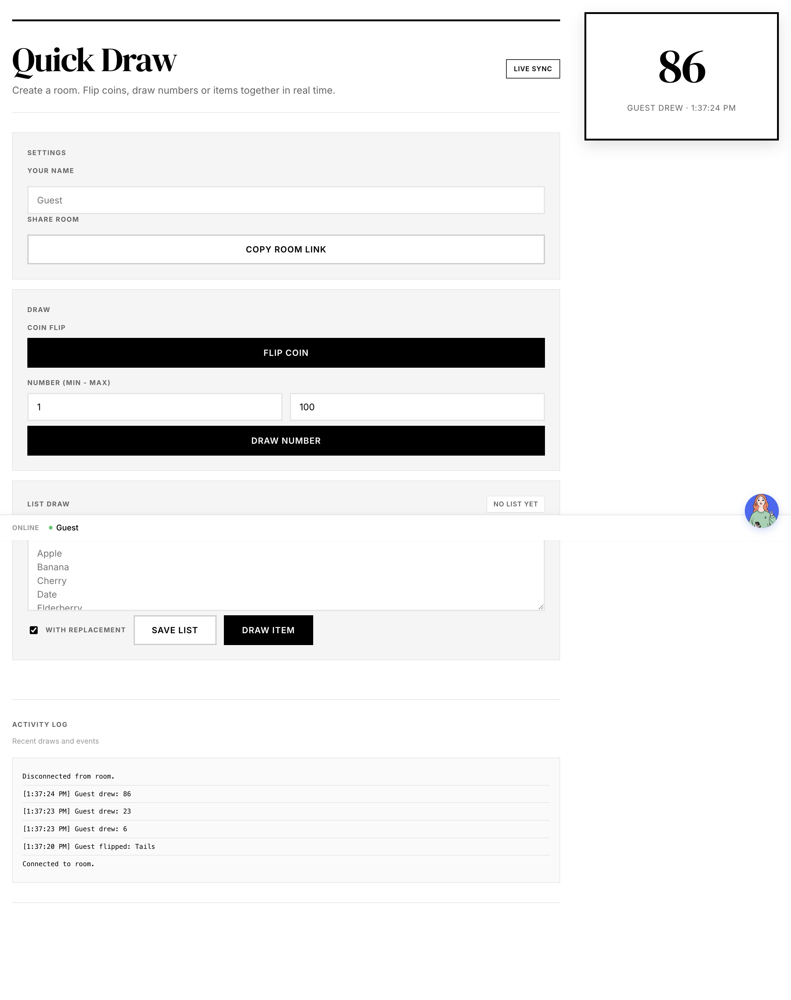

# Simple Random Rooms (Cloudflare Worker)

Lightweight real-time “draw room” built for Cloudflare Workers free tier. Users join a room via a short link, flip coins, draw numbers, or draw from a shared list (with/without replacement), and everyone sees results live.



## What’s included
- `worker.js`: Worker script + `RoomDurableObject` for room state and WebSocket fan-out. Inline HTML/CSS/JS UI.
- `wrangler.toml`: Wrangler config and Durable Object binding.
- `docs/screenshot.png`: UI preview.

## Requirements
- Node 18+ (for Wrangler)
- Cloudflare account + Workers + Durable Objects enabled
- `npm install -g wrangler` (or use `npx wrangler`)

## Quick start (local dev)
```sh
wrangler dev --local
# Open the printed URL, create a room, copy the link, join from another tab, and test coin/number/list draws.
```

## Deploy
```sh
wrangler deploy
```
Make sure `wrangler.toml` uses your account settings and Durable Object binding name (`ROOM_DO`).

## Repository layout
- `worker.js` – routes `/`, `/create-room`, `/room/:id`, `/ws/room/:id`; includes inline HTML/CSS/JS UI.
- `wrangler.toml` – Worker entrypoint and Durable Object migration.
- `.gitignore` – ignores node_modules, wrangler state, and build artifacts.
- `docs/screenshot.png` – UI preview.
